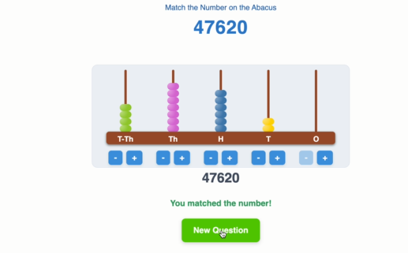

# 🧮 Abacus Game

A fun browser-based game to match numbers on an interactive abacus using HTML, Tailwind CSS, and JavaScript.

## 🚀 How to Play

1. A random 5-digit number appears at the top.
2. Use + and - buttons to match that number with beads.
3. Celebrate when you match it!

## 📷 Screenshot

## 🛠 Tech Stack

- HTML
- Tailwind CSS
- JavaScript
